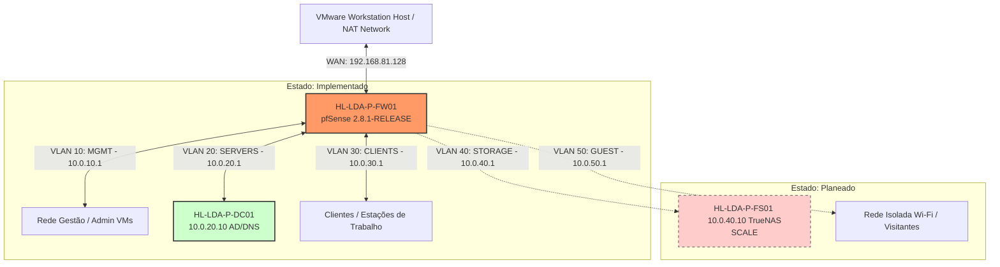

# Arquitetura Geral da Infraestrutura (v0.2.0)

```text
Estado: Definido arquiteturalmente (AD e Firewall implementados; Storage/Serviços planeados)
Versão: v0.2.0
```

Este documento estabelece o desenho de arquitetura corporativa da **HomeLab Consultoria & Contabilidade** para a versão **v0.2.0**. A infraestrutura foi projetada para garantir segurança no tratamento de dados financeiros e contabilidade para uma equipa inicial de 5 utilizadores.

---

## 1. Plataforma de Virtualização

Ao contrário de implementações baseadas em servidores físicos dedicados, toda a infraestrutura v0.2.0 é virtualizada localmente sobre a seguinte plataforma:

*   **Hipervisor / Host:** **VMware Workstation Pro**
*   **Virtualização:** Máquinas Virtuais (VMs) isoladas executando sistemas operativos dedicados (FreeBSD e Windows Server).
*   **Segmentação Virtual:** A segmentação de rede é feita através de redes virtuais personalizadas (Custom VMnet Local Networks) ou subinterfaces VLAN 802.1Q configuradas no pfSense e ligadas a switches virtuais do VMware Workstation.

---

## 2. Estado de Implementação dos Componentes

Para assegurar a fidelidade operacional da documentação, os componentes da infraestrutura estão divididos por estados reais de atividade:

### 2.1 Componentes Implementados (Operacionais)

*   **Firewall & Router (`HL-LDA-P-FW01`):** Máquina virtual pfSense 2.8.1-RELEASE ativa. Fornece filtragem de pacotes, DHCP básico e roteamento virtual.
*   **Active Directory Domain Controller (`HL-LDA-P-DC01`):** Servidor Windows Server 2025 promovido a DC do domínio `corp.homelab.ao`. Serviços de AD DS, DNS local, Kerberos e LDAP operacionais.
*   **VLANs 10 (MGMT), 20 (SERVERS) e 30 (CLIENTS):** Definidas lógicas e com tráfego roteado e ativo no pfSense.

### 2.2 Componentes Planeados (Desenho Arquitetural)

*   **VLAN 40 (STORAGE) e VLAN 50 (GUEST):** Redes lógicas planeadas para isolamento futuro de dados e convidados.
*   **Servidor de Armazenamento (`HL-LDA-P-FS01`):** TrueNAS SCALE planeado para centralização de partilhas SMB.
*   **Servidor de Monitorização (`HL-LDA-P-MON01`):** Zabbix/Prometheus planeado para observabilidade de recursos.
*   **Servidor de Backup (`HL-LDA-P-BKP01`):** Veeam Backup planeado em máquina de grupo de trabalho (fora do domínio).

---

## 3. Diagrama de Blocos Lógicos de Rede

O diagrama abaixo descreve a segmentação e conectividade virtual na VMware Workstation Pro:



---

## 4. Evolução da Infraestrutura

*   **v0.1.0 (Histórico):** Primeira validação conceptual em sub-rede única (`lan.homelab.ao` em `10.0.10.0/24`). Descontinuada e totalmente removida. Ver [versions/v0.1.0/README.md](../../versions/v0.1.0/README.md).
*   **v0.2.0 (Arquitetura Atual):** Implementação do novo domínio `corp.homelab.ao` com segmentação por VLANs no pfSense 2.8.1-RELEASE e Windows Server 2025.
*   **v0.3.0 (Próxima Evolução - Planeada):** Integração do Storage TrueNAS, ativação de quotas SMB, backups Veeam e segurança granular de rede inter-VLAN.
