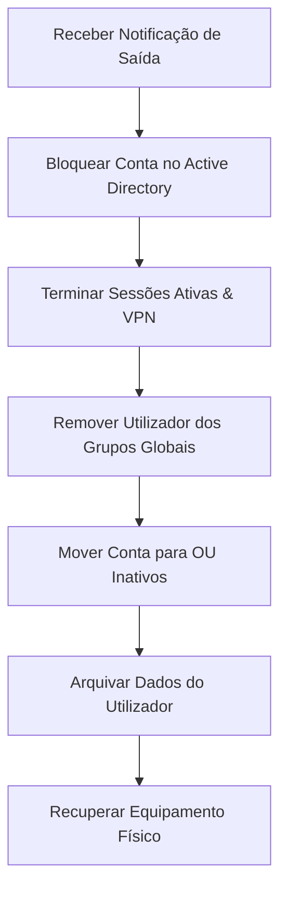

# Procedimento Operacional: Processo de Offboarding de Colaboradores (v0.2.0)

Este documento descreve o fluxo de trabalho obrigatório e normalizado para a saída (offboarding) ou revogação de acessos de um colaborador da **HomeLab Consultoria & Contabilidade**, garantindo a segurança dos dados corporativos.

---

## Fluxo de Trabalho do Processo (Passo a Passo)



---

## Checklist de Offboarding

### Fase 1: Bloqueio Imediato de Acessos Lógicos
- [ ] **Desativação no Active Directory:** Executar a desativação da conta de rede imediatamente para impedir novos logons.
  *   *Comando PowerShell:*
      ```powershell
      Disable-ADAccount -Identity "nome.apelido"
      ```
- [ ] **Alteração de Password:** Alterar a password da conta para um valor aleatório de 32 caracteres gerado automaticamente para prevenir logons residuais.
  *   *Comando PowerShell:*
      ```powershell
      $RandomPassword = [System.Web.Security.Membership]::GeneratePassword(32, 5)
      $SecurePass = ConvertTo-SecureString $RandomPassword -AsPlainText -Force
      Set-ADAccountPassword -Identity "nome.apelido" -NewPassword $SecurePass -Reset $true
      ```
- [ ] **Revogação de VPN:** Aceder à consola web do pfSense (`10.0.10.1`) e terminar imediatamente qualquer sessão OpenVPN/WireGuard ativa para o utilizador.
- [ ] **Sessões Locais:** Se o utilizador possuir sessões de trabalho ativas no TrueNAS SCALE (`HL-LDA-P-FS01`), reiniciar os serviços de ligação de ficheiros Samba correspondentes para desconectar as pastas mapeadas.

### Fase 2: Limpeza de Permissões de Grupo
- [ ] **Remover de Grupos Globais:** Remover a conta de utilizador de todos os grupos de segurança do departamento (ex: `GG-Financeiro`, `GG-Comercial`) para garantir que mesmo que a conta seja reativada por erro, não tenha acessos residuais aos recursos.
  *   *Comando PowerShell:*
      ```powershell
      $User = Get-ADUser -Identity "nome.apelido"
      $Groups = Get-ADPrincipalGroupMembership -Identity $User.SamAccountName | Where-Object { $_.Name -ne "Domain Users" }
      foreach ($Group in $Groups) {
          Remove-ADGroupMember -Identity $Group.Name -Members $User.SamAccountName -Confirm:$false
      }
      ```

### Fase 3: Organização de Contas Inativas
- [ ] **Mover Conta:** Mover o objeto de utilizador desativado para a OU de inativos ou para uma sub-pasta dedicada dentro do AD para fins de auditoria histórica.
  *   *Comando PowerShell:*
      ```powershell
      Move-ADObject -Identity (Get-ADUser -Identity "nome.apelido").DistinguishedName `
                    -TargetPath "OU=Disabled,OU=01_Users,DC=corp,DC=homelab,DC=ao"
      ```
      *(Nota: Criar a sub-OU `Disabled` dentro de `01_Users` se ainda não existir).*

### Fase 4: Cópia de Segurança e Arquivo de Dados
- [ ] **Pasta Pessoal:** Aceder ao servidor de ficheiros TrueNAS e mover qualquer pasta pessoal ou ficheiros específicos do utilizador para um repositório centralizado de arquivo de ex-colaboradores (com acesso limitado apenas à Direção e IT).
- [ ] **Retenção:** A conta desativada deve ser mantida por um período de **90 dias** antes da sua eliminação definitiva para garantir que tarefas agendadas ou fluxos de trabalho associados à conta possam ser reatribuídos.

### Fase 5: Devolução de Ativos Físicos
- [ ] **Inventário:** Recolher o hardware entregue (Portátil, carregador, rato, adaptadores, etc.).
- [ ] **Verificação física:** Avaliar o estado físico do equipamento.
- [ ] **Atualização:** Atualizar o estado do ativo em `inventory/assets.md` para "Disponível em Stock".
