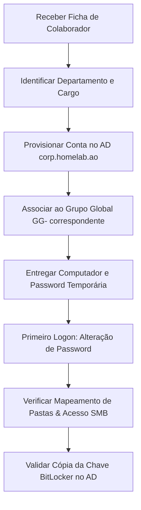

# Procedimento Operacional: Processo de Onboarding de Colaboradores (v0.2.0)

Este documento estabelece o fluxo de trabalho detalhado para a entrada em funções (onboarding) de um novo colaborador na **HomeLab Consultoria & Contabilidade**, garantindo a atribuição correta de permissões sob a versão v0.2.0.

---

## Fluxo de Trabalho do Processo (Passo a Passo)



---

## Checklist de Onboarding

### Fase 1: Validação de Dados Administrativos
- [ ] Validar ficha com: Nome Completo, Departamento, Cargo e Identificação da Estação de Trabalho atribuída (conforme `inventory/assets.md`).
- [ ] Determinar o grupo de rede do utilizador (`GG-Financeiro`, `GG-Comercial` ou `GG-Direcao`).

### Fase 2: Provisionamento Digital no Active Directory
- [ ] Criar a conta de utilizador na sub-OU de departamento sob **`01_Users`** (seguindo o padrão `nome.apelido`), utilizando as instruções em [Criação de Utilizador](create-user.md).
- [ ] Configurar os campos:
    *   **Description:** Cargo profissional (ex: "Contabilista Assistente").
    *   **Department:** Nome do departamento (ex: "Financeiro").
    *   **Telephone Number:** Número de ramal interno do utilizador (VoIP).
- [ ] Adicionar o utilizador ao Grupo Global do departamento correspondente.
    *   *Exemplo:* Adicionar `ana.silva` ao grupo `GG-Financeiro`.
    *   *Nota:* O aninhamento de grupos (AGDLP) atribui automaticamente o utilizador aos grupos locais do domínio (ex: `DL-FS-Financeiro-RW` e `DL-FS-Publico-RW`), garantindo o acesso às partilhas de rede no TrueNAS SCALE.

### Fase 3: Preparação da Estação de Trabalho e Primeiro Logon
- [ ] Assegurar que a estação de trabalho está ligada à **VLAN 30 (CLIENTS)** na porta física ou SSID corporativo correto.
- [ ] Ligar o computador e iniciar sessão na conta do utilizador pela primeira vez usando a password temporária gerada.
- [ ] Solicitar ao utilizador para introduzir a sua nova password pessoal e confidencial (mínimo de 12 caracteres, com complexidade exigida por GPO).
- [ ] Aguardar o carregamento do ambiente de trabalho do Windows e a execução automática do script de mapeamento de drives.

### Fase 4: Verificação no Endpoint do Utilizador
- [ ] **Mapeamentos de Rede:** Abrir o Explorador de Ficheiros e verificar se as unidades mapeadas via GPO estão operacionais (ex: Unidades `F:`, `G:`, `P:` conforme o perfil do utilizador).
- [ ] **Teste de Escrita:** Entrar numa pasta autorizada da partilha de rede e validar a criação e eliminação de um ficheiro de teste.
- [ ] **Verificação de Bloqueio (USB):** Inserir uma pen USB externa na estação e verificar se o sistema bloqueia o acesso, retornando "Acesso Negado" (validação da `GPO_WKS_RestrictUSB`).
- [ ] **BitLocker:** Abrir a consola do PowerShell na estação de trabalho como administrador local e forçar a sincronização e envio da chave de segurança BitLocker para o Active Directory:
    ```powershell
    # Comando para forçar a cópia da chave para o AD
    $Volume = Get-BitLockerVolume -MountPoint "C:"
    Backup-BitLockerKeyProtector -MountPoint "C:" -KeyProtectorId $Volume.KeyProtector[0].KeyProtectorId
    ```
- [ ] Confirmar na consola do AD DS no DC se a chave do BitLocker está visível nas propriedades do objeto de computador correspondente.
